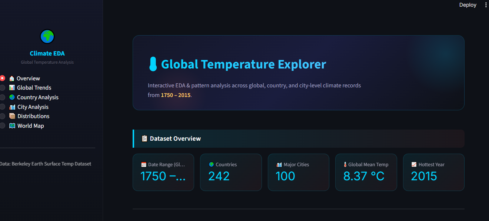
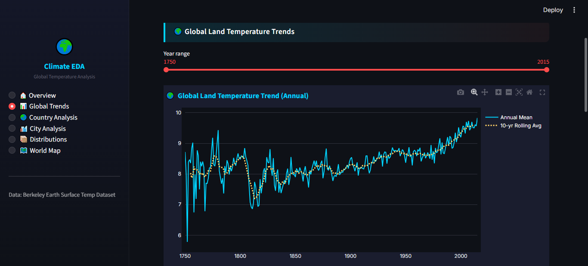

# 🌍 Climate Analysis & Global Temperature EDA Dashboard

## 📌 Overview
Climate change is one of the most critical global challenges of the modern era.  
This project performs comprehensive Exploratory Data Analysis (EDA) and interactive visualization on historical global temperature datasets to study long-term climate trends, seasonal variations, and global warming patterns.

The project combines:
- Data preprocessing
- Statistical analysis
- Interactive visualizations
- Streamlit dashboard development

to provide meaningful climate insights through an intuitive analytics platform.

---

# ❓ Problem Statement
Global temperatures have been rising steadily over the past centuries due to climate change and environmental factors. Understanding historical climate trends is essential for:
- Identifying warming patterns
- Comparing temperature changes across countries and cities
- Studying seasonal climate behavior
- Visualizing long-term environmental changes

This project aims to analyze historical temperature datasets and build an interactive dashboard for climate data exploration and visualization.

---

# 🎯 Objectives
- Analyze historical global temperature trends
- Study country-wise and city-wise climate variations
- Detect warming patterns over decades
- Perform seasonal and statistical analysis
- Create interactive visualizations using Plotly
- Build a Streamlit dashboard for real-time exploration

---

# 🚀 Features
✔ Data Cleaning & Preprocessing  
✔ Missing Value Analysis  
✔ Global Temperature Trend Analysis  
✔ Seasonal Climate Pattern Analysis  
✔ Country-wise Warming Analysis  
✔ City-wise Temperature Analysis  
✔ Correlation Analysis  
✔ Interactive Plotly Visualizations  
✔ Geo-Spatial Climate Maps  
✔ Temperature Distribution Analysis  
✔ Interactive Streamlit Dashboard  
✔ Multi-page Analytics Interface  

---

# 🛠️ Technologies & Tools Used

## Programming Language
- Python

## Libraries & Frameworks
- Pandas
- NumPy
- Matplotlib
- Seaborn
- Plotly
- Streamlit
- Jupyter Notebook

## Development Tools
- Git
- GitHub
- VS Code

---

# 📂 Project Structure

```bash
Climate-Analysis-Project/
│
├── datasets/                  # Climate datasets (stored locally, not uploaded)
│
├── src/
│   ├── __init__.py
│   ├── data_loader.py         # Dataset loading utilities
│   ├── preprocessing.py       # Data cleaning & feature engineering
│   ├── analysis.py            # EDA and statistical analysis functions
│   └── visualization.py       # Plotly & visualization utilities
│
├── app/
│   ├── app.py                 # Streamlit dashboard application
│   └── components.py          # Reusable UI components
│
├── notebooks/
│   └── analysis.ipynb         # Complete EDA notebook
│
├── scripts/
│   └── generate_notebook.py   # Notebook generation script
│
├── images/                    # Dashboard screenshots & visualizations
│
├── requirements.txt
├── README.md
├── LICENSE
└── .gitignore
```

---

# 📁 Dataset
The dataset used in this project is the Berkeley Earth Global Temperature Dataset.

### Dataset Source
https://www.kaggle.com/datasets/berkeleyearth/climate-change-earth-surface-temperature-data

### Dataset Files Used
- GlobalTemperatures.csv
- GlobalLandTemperaturesByCountry.csv
- GlobalLandTemperaturesByMajorCity.csv
- GlobalLandTemperaturesByState.csv
- GlobalLandTemperaturesByCity.csv

### Note
Due to large file size, datasets are not uploaded to this repository.

---

# ⚙️ Installation

## 1. Clone Repository
```bash
git clone https://github.com/yourusername/Climate-Analysis-Project.git
```

## 2. Navigate to Project Folder
```bash
cd Climate-Analysis-Project
```

## 3. Install Dependencies
```bash
pip install -r requirements.txt
```

---

# ▶️ How to Run

## Run Streamlit Dashboard
```bash
python -m streamlit run app/app.py
```

## Run Jupyter Notebook
Open:
```bash
notebooks/analysis.ipynb
```

---

# 📊 Methods Used

## Data Preprocessing
- Missing value handling
- Datetime conversion
- Feature engineering
- Coordinate conversion
- Seasonal mapping

## Exploratory Data Analysis
- Descriptive statistics
- Correlation analysis
- Trend analysis
- Comparative analysis

## Data Visualization
- Line charts
- Histograms
- Boxplots
- Heatmaps
- Choropleth maps
- Geo scatter maps
- Interactive dashboards

---

# 📈 Dashboard Features
The Streamlit dashboard provides:
- Interactive climate trend exploration
- Country-wise analysis
- City temperature analysis
- Seasonal temperature visualization
- Dynamic filtering & visualization
- Interactive Plotly charts
- Geographical climate maps

---

# 🔍 Key Insights
- Global temperatures show a clear increasing trend over time
- Post-1950 warming is significantly higher compared to earlier decades
- Arctic and sub-arctic regions exhibit stronger warming patterns
- Seasonal temperature variations differ across countries
- Certain cities consistently experience extreme temperature conditions
- Temperature distributions indicate long-term climate shifts

---

# 📸 Dashboard Screenshots

## Home Dashboard


## Global Trend Analysis


## Climate Visualization


---

# 📊 Results & Conclusion
The analysis demonstrates a significant long-term increase in global temperatures, especially after the industrial era. Interactive visualizations and dashboard analytics reveal clear warming trends across countries and cities, highlighting the growing impact of climate change.

The project successfully combines data analytics, visualization, and dashboard development to create an informative climate analysis platform.

---

# 🔮 Future Work
- Machine Learning Temperature Forecasting
- Real-time Climate API Integration
- Advanced Geospatial Analytics
- Predictive Climate Modeling
- Deployment on Streamlit Cloud
- User Authentication & Personalization
- AI-based Climate Prediction System

---

# 👨‍💻 Author
Pari Shree Gupta

---

# 📜 License
This project is licensed under the MIT License.

---

# ⭐ Support
If you found this project useful, consider giving it a ⭐ on GitHub.
